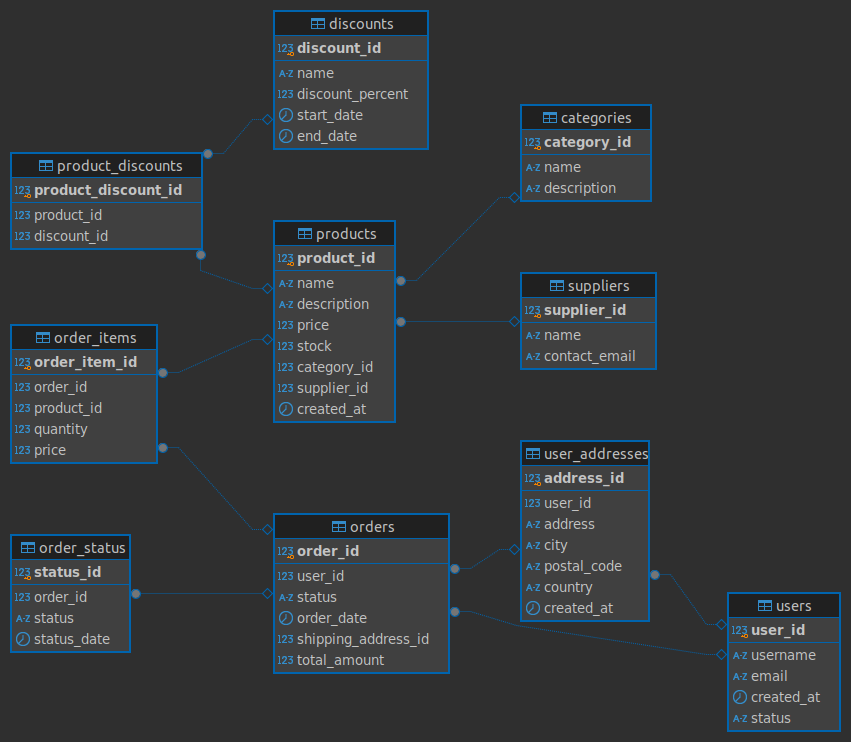

# Backend para tienda online

Se debe implementar un backend para una tienda online

## Descripción
Debe implementarse un backend para una tienda online, con varios endpoints


## Instrucciones
- Se debe iniciar el proyecto. El stack es **Java/Kotlin** y **Spring Boot**.
- Se debe usar la base de datos adjunta. Se proporciona un **docker compose** listo para usar.
- En caso de no usar docker, cargar el script ubicado db_init/init-db.sql en el servidor de base de datos local.
- La implementación debe hacerse teniendo en cuenta que esto es el **principio de un proyecto que se presupone irá creciendo con el tiempo**. Se debe seguir una **arquitectura** que permita al proyecto **escalar con las menores dificultades posibles**.

### Endpoints requeridos
1. **Desglose de ventas por categoría**: El desglose de ventas totales por categoría. Esto incluye la cantidad total vendida multiplicada por el precio del producto en cada categoría.
    ```json
    [
      {
        "category_name": "Home Appliances",
        "total_sales": 128565.90
      },
      {
        "category_name": "Electronics",
        "total_sales": 76611.08
      },
    ]
    ```
<br><br>
2. **Pedidos de un usuario específico**:
Un endpoint que devuelva todos los pedidos realizados por un usuario específico, incluyendo la fecha del pedido, el estado actual y el total gastado en cada pedido.
  ```json
  [
    {
      "order_id": 1,
      "order_date": "2023-01-01 14:00:00.000",
      "status": "processing",
      "total_spent": 3799.96
    },
    {
      "order_id": 31,
      "order_date": "2023-02-01 16:10:00.000",
      "status": "delivered",
      "total_spent": 2599.94
    },
  ]
  ```
<br><br>
3. **Producto más vendido por categoría**: Debe identificar el producto más vendido en cada categoría. La respuesta debe incluir el nombre de la categoría, el nombre del producto y la cantidad total vendida.
```json
  [
    {
    "category_name": "Beauty & Personal Care",
    "product_name": "Sony WH-XB910N",
    "total_quantity_sold": 11
  },
  {
    "category_name": "Electronics",
    "product_name": "Apple Watch Series 8",
    "total_quantity_sold": 15
  }
  ]
  ```
   <br><br>
4. **Descuentos más altos mediante una API externa**: Este endpoint debe devolver los 3 descuentos con mayor porcentaje. Esta información debe ser obtenida de una API externa en lugar de consultar la base de datos( GET: https://run.mocky.io/v3/161890d8-6a84-4cea-bd94-0001eb8a7dcd ). La implementación del cliente HTTP queda a su criterio. 
```json
     [
    {
        "name": "Year-End Clearance",
        "discount_percent": 80.0,
        "start_date": "2025-12-26",
        "end_date": "2025-12-31"
    },
    {
        "name": "Season's End Blowout",
        "discount_percent": 75.0,
        "start_date": "2025-11-01",
        "end_date": "2025-11-10"
    },
    {
        "name": "End of Season Clearance",
        "discount_percent": 70.0,
        "start_date": "2025-09-01",
        "end_date": "2025-09-15"
    }
    ]
   ```
   <br><br>
5. **Ejecución de tarea asíncrona**: El endpoint debe publicar un evento en rabbitMQ que, al ser consumido por la aplicación, realice la tarea asíncrona de activar todos los usuarios inactivos. (status = inactive => status = active)

```Respuesta:
  HTTP/1.1 204 No Content
  ```
<br><br>
## Criterios de aceptación
- El proyecto se ha inicializado correctamente.
- Los 5 endpoints realizan bien su funcionalidad y devuelven la información requerida.
- Realizar pruebas de testing de al menos uno de los endpoints.
- Implementar el control de errores y excepciones de al menos una parte de la aplicación.
- Diseño de eventos y asincronía.

## Recursos
### Diagrama ER de la base de datos 


## Desarrollo

1. Clonar el repositorio
2. Crear una nueva rama. El nombre será DEMPO-*[TUS INICIALES EN MAYÚSCULA]*

## Entrega

Una vez terminado realizar una **pull request** a la rama *main*.

## Utitlidades

- Iniciar la base de datos
  ```sh
  docker compose up --build
  ```

- Credenciales de conexión a la base de datos:
  - Nombre: *dempo*
  - Usuario: *dempo*
  - Password: *dempo*
  - Host: *localhost*
  - Puerto: *5432*

- Credenciales de conexión a RabbitMQ:
  - Usuario: *dempo*
  - Password: *dempo*
  - Host: *localhost*
  - Puerto: *5672*


